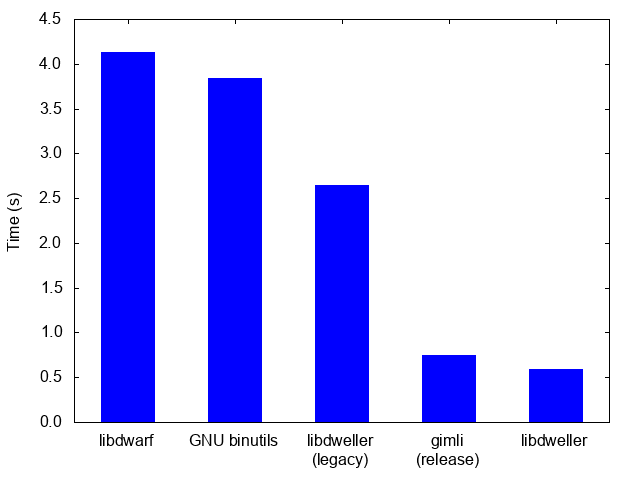

# libdweller

`libdweller` is a library for parsing DWARF debug data.

I hacked it together over the course of about 3 days, so the code is still
very hacky and experimental, but hopefully with time I can make it more
stable and production-ready.

## Building

```
$ meson . build
$ ninja -C build
$ ./build/examples/stacktrace
```

## Performance

This comparison is in no way representative, since dweller is still very
feature-incomplete, but considering dwarfdump can already successfully provide
most of the same information that existing tools can I was quite impressed by
the performance thus far.



### libdwarf

```
$ time dwarfdump /usr/lib/debug/lib/x86_64-linux-gnu/libc-2.27.so > /dev/null

real    0m4.132s
user    0m4.080s
sys     0m0.048s
```

### GNU binutils

```
$ time readelf --debug /usr/lib/debug/lib/x86_64-linux-gnu/libc-2.27.so > /dev/null

real    0m3.845s
user    0m3.808s
sys     0m0.032s
```

### libdweller

```
$ time ./build/dwarfdump/dwarfdump /usr/lib/debug/lib/x86_64-linux-gnu/libc-2.27.so > /dev/null

real    0m2.641s
user    0m2.565s
sys     0m0.060s
```
